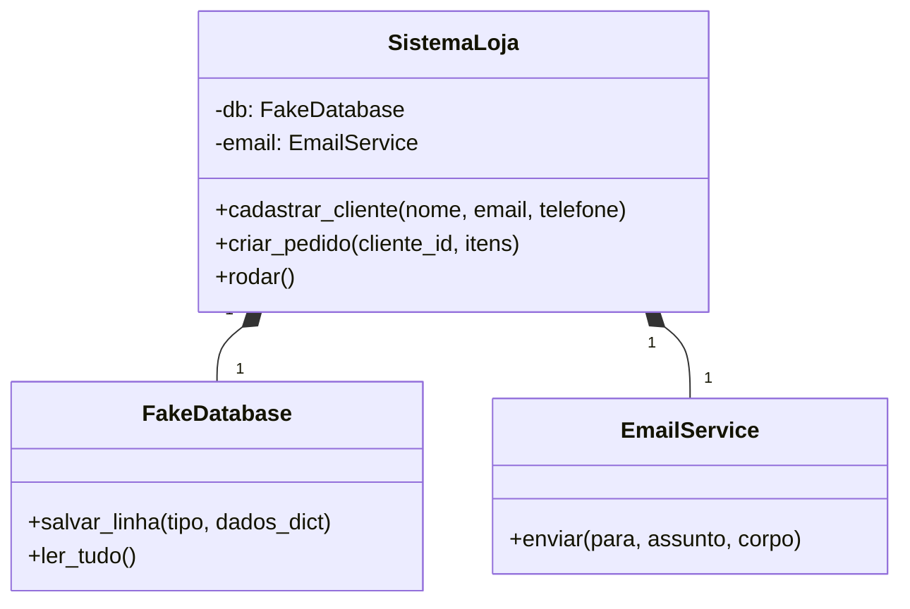
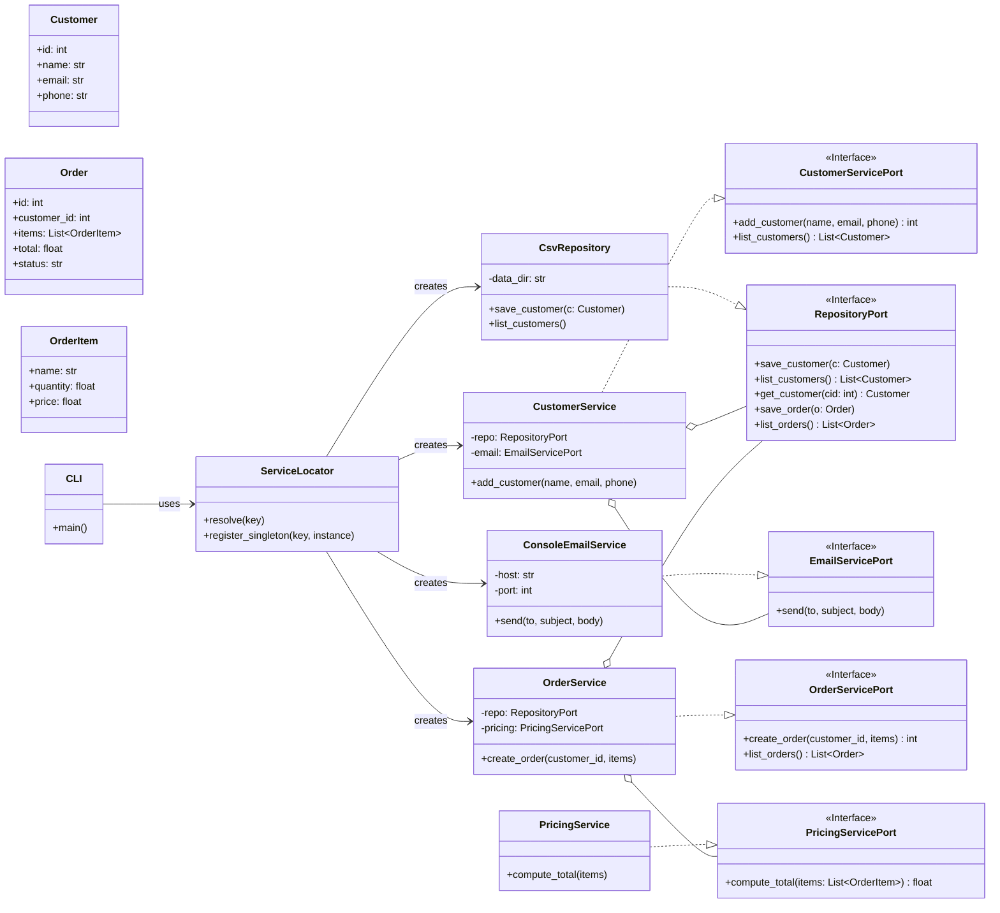

# 📌 Sistema Loja – README

Este repositório contém duas versões do **Sistema Loja**:

1. **Versão Inicial (Sem Padrões – propositalmente mal projetada)**  
2. **Versão Refatorada (Arquitetura Limpa com IoC e SOLID)**  

---

## ⚠️ Versão Inicial – Propositalmente Mal Projetada

> **Atenção:** Esta versão foi criada apenas para estudo, mostrando **o que não fazer** em termos de arquitetura e boas práticas.

### 🚀 Como executar
Requisitos:  
- Python **3.10+**

Passos:
```bash
cd versao_inicial
python main.py
```

Será exibido um menu interativo para cadastrar clientes, criar pedidos e listar dados.  
Os registros são salvos de forma frágil em `dados_loja.csv`.

---

### ❌ Problemas da Arquitetura
- **God Object**: a classe `SistemaLoja` concentra múltiplas responsabilidades:
  - Interface com o usuário (`rodar`)
  - Regras de negócio (`_calcular_total`)
  - Persistência (`FakeDatabase`)
  - Notificações (`EmailService`)

- **Spaghetti Code**: o método `rodar` possui fluxo confuso com `if/elif` aninhados e uso excessivo de `input()`.

- **Lava Flow**: código morto não removido, como `OBSOLETE_CONFIG` e `_algoritmo_precos_v1_obsoleto`.

- **Magic Numbers**: valores como `GLOBAL_DISCOUNT`, `TAXA` e `FRETE_FIXO` estão hardcoded, dificultando configuração.

---

### 📉 Violações dos Princípios SOLID
- **SRP (Responsabilidade Única):** `SistemaLoja` faz tudo, quebrando o princípio.  
- **OCP (Aberto/Fechado):** é impossível estender sem modificar código já existente.  
- **DIP (Inversão de Dependência):** depende diretamente de `FakeDatabase` e `EmailService`, sem abstrações.

---

### 📊 Diagrama UML (Versão Inicial)



---

## ✅ Versão Refatorada – Arquitetura Limpa

Esta versão foi **reestruturada seguindo boas práticas** de engenharia de software.

### 🔑 Principais melhorias
- **Arquitetura em Camadas:** `domain`, `services`, `infrastructure`, `app`.
- **Inversão de Dependência (DIP):** serviços dependem de interfaces, não de implementações concretas.
- **Inversão de Controle (IoC):** uso de um **Service Locator** para gerenciar dependências.
- **Configuração centralizada:** valores de negócio estão em `app/settings.py`.
- **CLI robusta:** construída com `argparse`.

---

### 🚀 Como executar
Requisitos:  
- Python **3.10+**

Passos:
```bash
cd versao_refatorada
python -m app.cli --help
```

Exemplos de uso:
```bash
# Cadastrar cliente
python -m app.cli clientes add --nome "Maria" --email "maria@example.com" --telefone "71999990000"

# Listar clientes
python -m app.cli clientes list

# Criar pedido
python -m app.cli pedidos add --cliente-id 1 --item "Teclado:1:150.0" --item "Mouse:2:75.50"

# Listar pedidos
python -m app.cli pedidos list
```

Os dados são armazenados em:
- `./data/clientes.csv`  
- `./data/pedidos.csv`  

---

### 📊 Diagrama UML (Versão Refatorada)


